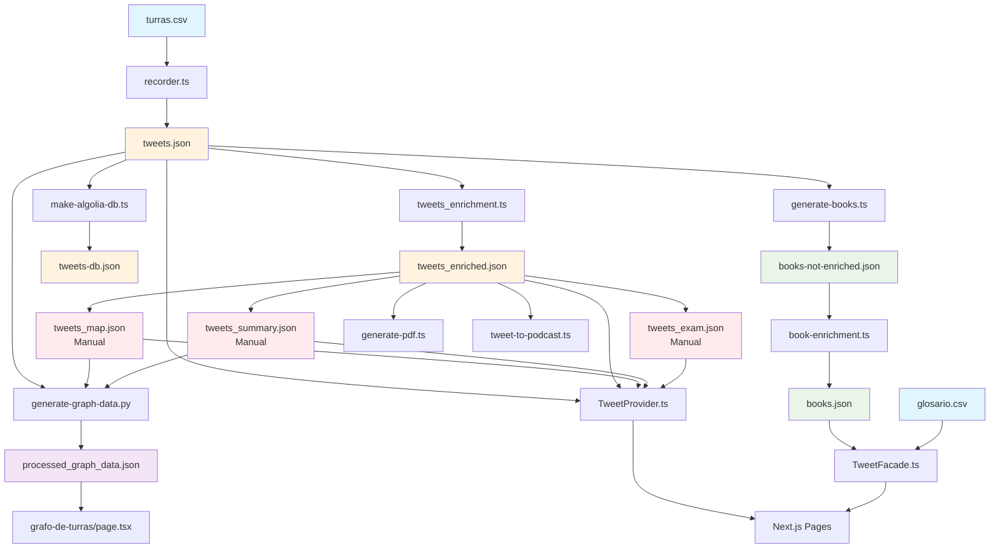

# Data Flow Mapping: Turrero Project

## Overview

This document maps the complete data flow for reading and writing JSON/CSV data in the Turrero project, identifying producers, consumers, and dependencies.

## Data Flow Diagram

## Data Producers (Scripts)

### Primary Data Generation
| Script | Input | Output | Purpose |
|--------|-------|---------|---------|
| `recorder.ts` | `turras.csv` | `tweets.json` | Scrapes X.com threads using Puppeteer |
| `tweets_enrichment.ts` | `tweets.json` | `tweets_enriched.json` | Extracts embedded tweet metadata |
| `make-algolia-db.ts` | `tweets.json` | `tweets-db.json` | Creates flattened search index |
| `generate-books.ts` | `tweets.json` | `books-not-enriched.json` | Extracts book references |
| `book-enrichment.ts` | `books-not-enriched.json` | `books.json` | AI categorizes books |

### Graph and Analytics
| Script | Input | Output | Purpose |
|--------|-------|---------|---------|
| `generate-graph-data.py` | `tweets.json`, `tweets_map.json`, `tweets_summary.json` | `processed_graph_data.json` | Aggregates data for graph visualization |

### Utility Scripts
| Script | Input | Output | Purpose |
|--------|-------|---------|---------|
| `generate-pdf.ts` | `tweets_enriched.json`, `tweets_map.json`, `tweets_summary.json` | PDF files | Generates PDF versions |
| `tweet-to-podcast.ts` | `tweets.json`, `tweets_enriched.json` | `tweets_podcast.json` | Podcast episode data |

## Data Consumers (Frontend)

### Infrastructure Layer
| Component | Input Files | Purpose |
|-----------|-------------|---------|
| `TweetProvider.ts` | `tweets.json`, `tweets_enriched.json`, `tweets_map.json`, `tweets_summary.json`, `tweets_exam.json`, `tweets_podcast.json`, `processed_graph_data.json` | Central data access singleton |
| `TweetFacade.ts` | `books.json`, `glosario.csv` | Books and glossary access |

### Pages and Components
| Component | Data Source | Purpose |
|-----------|-------------|---------|
| `app/page.tsx` | TweetFacade | Homepage with categorized threads |
| `app/turra/[id]/page.tsx` | TweetProvider | Individual thread display |
| `app/biblioteca/page.tsx` | TweetFacade | Books library |
| `app/glosario/page.tsx` | TweetFacade | Glossary terms |
| `app/grafo-de-turras/page.tsx` | TweetProvider | Graph visualization |
| `app/[category]/page.tsx` | TweetFacade | Category-filtered threads |

### Components
| Component | Data Source | Purpose |
|-----------|-------------|---------|
| `TweetContent.tsx` | TweetProvider | Tweet rendering with embeds |
| `TurraSidebar.tsx` | TweetProvider | Related content sidebar |
| `TurraExam.tsx` | TweetProvider | Quiz questions |
| `BookGrid.tsx` | TweetFacade | Book display grid |

## Manual vs Auto-Generated Files

### Auto-Generated (DO NOT EDIT)
- `tweets.json` - Generated by `recorder.ts`
- `tweets-db.json` - Generated by `make-algolia-db.ts`
- `tweets_enriched.json` - Generated by `tweets_enrichment.ts`
- `books-not-enriched.json` - Generated by `generate-books.ts`
- `books.json` - Generated by `book-enrichment.ts`
- `processed_graph_data.json` - Generated by Python script

### Manually Managed
- `turras.csv` - Master list of threads to scrape
- `glosario.csv` - Glossary terms and definitions
- `tweets_map.json` - Thread categorization
- `tweets_summary.json` - Thread summaries
- `tweets_exam.json` - Quiz questions
- `tweets_podcast.json` - Podcast episode metadata

## Pipeline Dependencies

### Primary Pipeline
1. `turras.csv` → `recorder.ts` → `tweets.json`
2. `tweets.json` → `tweets_enrichment.ts` → `tweets_enriched.json`
3. `tweets.json` → `make-algolia-db.ts` → `tweets-db.json`
4. `tweets.json` → `generate-books.ts` → `books-not-enriched.json`
5. `books-not-enriched.json` → `book-enrichment.ts` → `books.json`

### AI Processing Pipeline
1. Generate prompts: `./scripts/generate_prompts.sh`
2. Process prompts with `ai-prompt-processor` agent
3. Update manual files: `tweets_summary.json`, `tweets_map.json`, `tweets_exam.json`, `books.json`

### Graph Pipeline
1. Python script reads: `tweets.json`, `tweets_map.json`, `tweets_summary.json`
2. Generates: `processed_graph_data.json`

## File Sizes and Update Frequency

| File | Size | Update Frequency | Last Modified |
|------|------|------------------|---------------|
| `tweets.json` | 5.5MB | After each scrape | Aug 13 |
| `tweets-db.json` | 2.7MB | After Algolia update | Aug 13 |
| `tweets_enriched.json` | 1.0MB | After enrichment | Mar 3 |
| `books.json` | 142KB | After book enrichment | Mar 2 |
| `processed_graph_data.json` | 99KB | After graph generation | Aug 13 |
| `books-not-enriched.json` | 97KB | After book extraction | Mar 3 |
| `turras.csv` | 41KB | Manual updates | Aug 13 |
| `tweets_summary.json` | 28KB | Manual AI updates | Mar 3 |
| `tweets_exam.json` | 233KB | Manual AI updates | Mar 3 |
| `tweets_map.json` | 21KB | Manual updates | Mar 3 |
| `glosario.csv` | 21KB | Manual updates | Aug 13 |
| `tweets_podcast.json` | 1.3KB | Rarely | Jan 11 |

## Key Observations

1. **Central Role of tweets.json**: This is the primary data source that feeds most other processes
2. **Manual Bottleneck**: `tweets_map.json`, `tweets_summary.json`, and `tweets_exam.json` require manual updates
3. **Redundant Data**: Some information is duplicated across files (IDs, summaries, categories)
4. **Pipeline Order**: Clear dependency chain from scraping to final consumption
5. **Hybrid Architecture**: Deno for scraping/processing, Node.js for frontend
6. **Search Optimization**: Separate flattened structure for Algolia